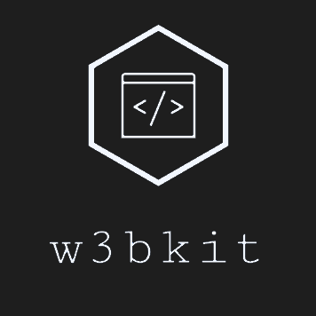

<div align='center'>
  <a href='#'>
    
  </a>
</div>

<h3 align='center'>
  A framework for developing websites and applications.
</h3>

<br>

## Table of contents

- [Quick start](#quick-start)
- [Status](#status)
- [Content scale](#content-scale)
- [Features](#features)
- [Bugs](#bugs)
- [Documentation](#documentation)
- [Contributing](#contributing)
- [Versioning](#versioning)
- [Creators](#creators)
- [Copyright and license](#copyright-and-license)

## Quick start

There are several options to start with:

- Download the [latest release](#) :point_left: coming soon!
- Clone the repo: `git clone https://github.com/artlabs/w3bkit.git`

## Status

:exclamation: under development

## Content scale

With the download of the latest release you will find following folders and files:
```text
w3bkit/
├─ css/
│  ├─ w3b.css
│  ├─ w3b.css.map
│  ├─ w3b.min.css
│  └─ w3b.min.css.map
└─ ...
```

## Features

## Bugs

## Documentation

You will find a full documentation [here](docs/w3bkit.md).

## Contributing

Do you want to become part of the team? We are hiring!

Before you contact us, please read our [contributing guidelines](.github/CONTRIBUTING.md). If you are still interested send us a message on [twitter](https://twitter.com/artlabs3).

## Versioning

w3bkit is maintained under the [semantic versioning](https://semver.org/).

## Creators

- **Benjamin Grill**  **·** [github](https://github.com/benjamin-grill) **·** [twitter](https://twitter.com/artlabs3)

## Copyright and license

Copyright 2020 artlabs. Code released under the [MIT License](LICENSE).
